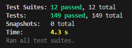
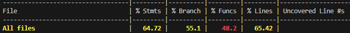

# Testing Documentation

This document outlined the testing strategy, procedures, and final verified results for the SmartDine platform. Our quality assurance approach combined automated unit testing for backend services with manual verification for the frontend web application to ensure robust performance and reliability.

## Table of Contents

- [Scope and Strategy](#scope-and-strategy)
- [API Automated Unit Test Procedure](#api-automated-unit-test-procedure)
- [API Coverage Procedure](#api-coverage-procedure)
- [Manual Web Testing Procedure](#manual-web-testing-procedure)
- [Writing Tests](#writing-tests)
- [Troubleshooting](#troubleshooting)
- [Latest Verified Results](#latest-verified-results)

## Scope and Strategy

The testing scope encompassed both the API backend and the Web frontend.

| Component                       | Testing Approach       | Purpose                                                                  |
| ------------------------------- | ---------------------- | ------------------------------------------------------------------------ |
| **Backend** (`@smartdine/api`)  | Automated unit testing | Ensured business logic reliability and API contract integrity            |
| **Frontend** (`@smartdine/web`) | Manual testing         | Verified UI/UX interactions, responsive design, and end-to-end workflows |

## API Automated Unit Test Procedure

Automated unit tests validated individual functions, controllers, and services within the API. We executed these tests using Vitest, our standard testing framework.

### Running Tests

To execute the unit test suite locally, we ran the following command:

```bash
pnpm --filter @smartdine/api test
```

### Running Tests in Watch Mode

During development, we used watch mode to automatically re-run tests whenever we made file changes:

```bash
pnpm --filter @smartdine/api test:watch
```



## API Coverage Procedure

We generated code coverage reports to ensure our automated tests exercised a sufficient percentage of the codebase, which highlighted potential areas for additional test implementation.

### Generating Coverage Reports

To generate the coverage report, we ran the following command:

```bash
pnpm --filter @smartdine/api test:cov
```

The system generated the coverage report in the `coverage/` directory within the API package. We viewed the detailed report by opening `coverage/index.html` in a browser.



## Manual Web Testing Procedure

Testing for the web application was exclusively a manual process. QA personnel and developers manually interacted with the UI to verify feature requirements, state management, and visual consistency across different viewport sizes.

### Starting the Development Server

To spin up the local development server for manual web testing, we executed the following command:

```bash
pnpm --filter @smartdine/web dev
```

The development server started at `http://localhost:5173` (or the configured port). We opened this URL in a preferred browser to begin testing.

### Testing Environment

For comprehensive testing, we verified the application across the following environments:

| Environment | Viewport Size  | Browser                       |
| ----------- | -------------- | ----------------------------- |
| Mobile      | 375px - 428px  | Chrome, Safari                |
| Tablet      | 768px - 1024px | Chrome, Safari, Edge          |
| Desktop     | 1920px+        | Chrome, Firefox, Safari, Edge |

### Core User Flows

#### Navigation Flow

- [x] Navigated between all main pages using the navigation menu
- [x] Verified page titles updated correctly
- [x] Tested browser back and forward buttons
- [x] Verified URL updates reflected the current page state
- [x] Tested direct URL access to specific pages

#### Form Interactions

- [x] Submitted valid forms and verified successful submissions
- [x] Tested all validation rules (required fields, format validation, length limits)
- [x] Verified error messages displayed appropriately for invalid inputs
- [x] Tested form reset functionality
- [x] Verified form data persisted during navigation (when applicable)
- [x] Tested keyboard navigation (Tab, Enter, Escape)

#### Data Display

- [x] Verified data loaded correctly on page load
- [x] Tested that empty states displayed appropriate messages
- [x] Verified loading indicators appeared during data fetches
- [x] Tested data refresh functionality
- [x] Verified data updates reflected in real-time (when applicable)

#### User Actions

- [x] Tested all interactive elements (buttons, links, toggles)
- [x] Verified hover states and active states
- [x] Tested modal/dialog open and close functionality
- [x] Verified confirmation dialogs for destructive actions
- [x] Tested dropdown menus and select inputs

### Responsive Design Verification

#### Mobile (< 768px)

- [x] Navigation menu collapsed to a hamburger menu
- [x] Touch targets were at least 44x44 pixels
- [x] Text remained readable without zooming
- [x] Horizontal scrolling was not required
- [x] Images scaled appropriately

#### Tablet (768px - 1024px)

- [x] Layout adapted to the tablet viewport
- [x] Navigation remained accessible
- [x] Touch interactions worked smoothly
- [x] Content spacing was appropriate

#### Desktop (> 1024px)

- [x] Full navigation menu was visible
- [x] Content utilized available screen space
- [x] Hover interactions worked as expected
- [x] Keyboard navigation was fully functional

### Accessibility Testing

- [x] Verified all images had alt text
- [x] Tested keyboard navigation through all interactive elements
- [x] Verified focus indicators were visible
- [x] Tested with a screen reader (where available)
- [x] Verified color contrast met WCAG standards
- [x] Tested that form labels were properly associated with inputs

### Performance Verification

- [x] Pages loaded within an acceptable time (< 3 seconds)
- [x] Interactions felt responsive (< 100ms for UI updates)
- [x] No layout shifts occurred during page load
- [x] Images were optimized and loaded efficiently
- [x] No console errors or warnings appeared

### Browser Compatibility

We tested the application across major browsers:

- [x] Chrome (latest version)
- [x] Firefox (latest version)
- [x] Safari (latest version)
- [x] Edge (latest version)

### Testing Checklist Summary

Once the server was running, we performed manual verification across core user flows:

- [x] Navigation between pages
- [x] Form submissions and validation
- [x] Responsive design on mobile, tablet, and desktop viewports
- [x] State persistence and updates
- [x] Error handling and user feedback
- [x] Loading states and transitions
- [x] Accessibility compliance
- [x] Cross-browser compatibility
- [x] Performance benchmarks

## Writing Tests

### Test Structure

We organized tests alongside the code they tested:

```text
src/
├── services/
│   ├── order.service.ts
│   └── order.service.test.ts
├── controllers/
│   ├── order.controller.ts
│   └── order.controller.test.ts
```

### Naming Conventions

- Test files ended with `.test.ts` or `.spec.ts`
- Test names described the behavior being tested
- We used `describe` blocks to group related tests
- We used `it` or `test` for individual test cases

### Example Test

```typescript
import { describe, it, expect } from 'jest';
import { calculateTotal } from './order.service';

describe('calculateTotal', () => {
  it('should return 0 for empty order', () => {
    expect(calculateTotal([])).toBe(0);
  });

  it('should sum item prices correctly', () => {
    const items = [
      { price: 10, quantity: 2 },
      { price: 5, quantity: 1 },
    ];
    expect(calculateTotal(items)).toBe(25);
  });
});
```

## Troubleshooting

### Common Issues

#### Tests timing out

We increased the timeout in the test configuration or utilized `test.setTimeout()`.

#### Coverage not updating

We deleted the `coverage/` directory and regenerated the report.

## Latest Verified Results

The following metrics reflected the final automated test execution for the API:

### Test Suite Execution

| Metric         | Value                  |
| -------------- | ---------------------- |
| Test Suites    | 12 passed (12 total)   |
| Tests          | 149 passed (149 total) |
| Execution Time | 4.3 s                  |

### Test Coverage Metrics

| Metric     | Value  |
| ---------- | ------ |
| Statements | 64.72% |
| Branches   | 55.1%  |
| Functions  | 48.2%  |
| Lines      | 65.42% |
