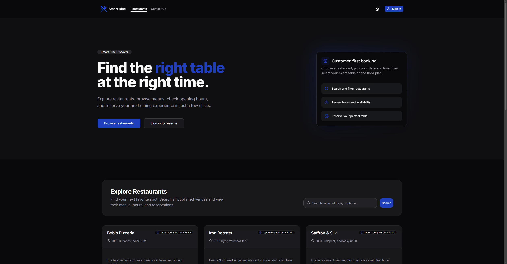
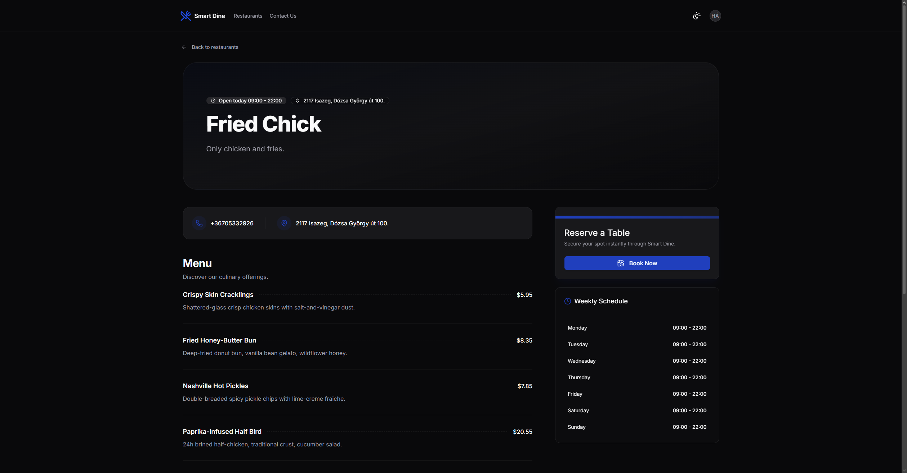
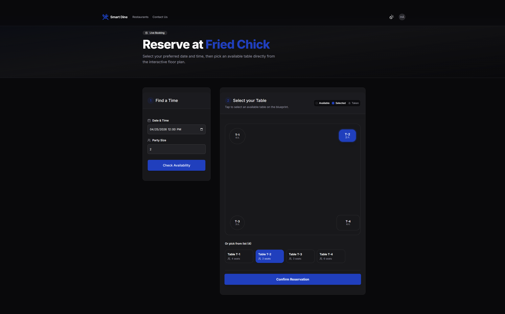
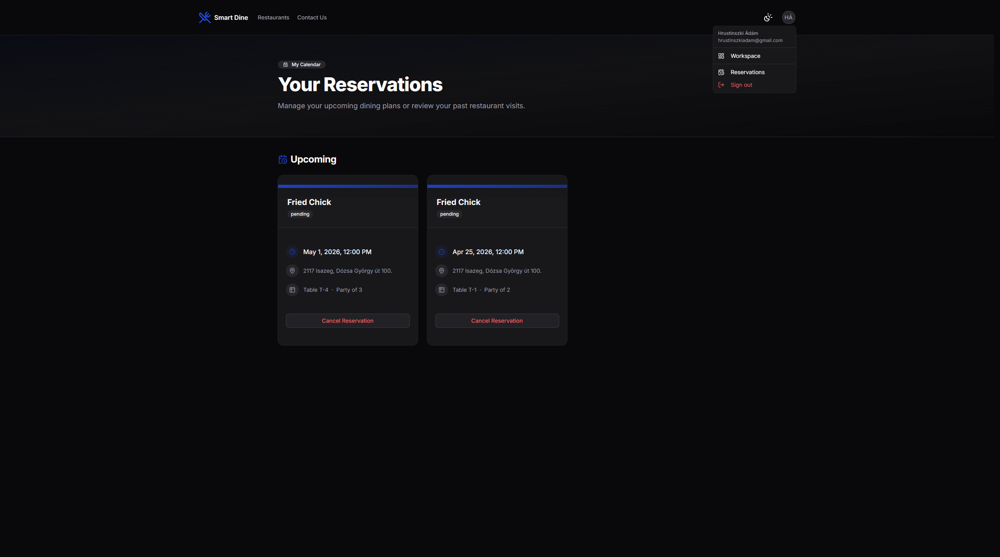
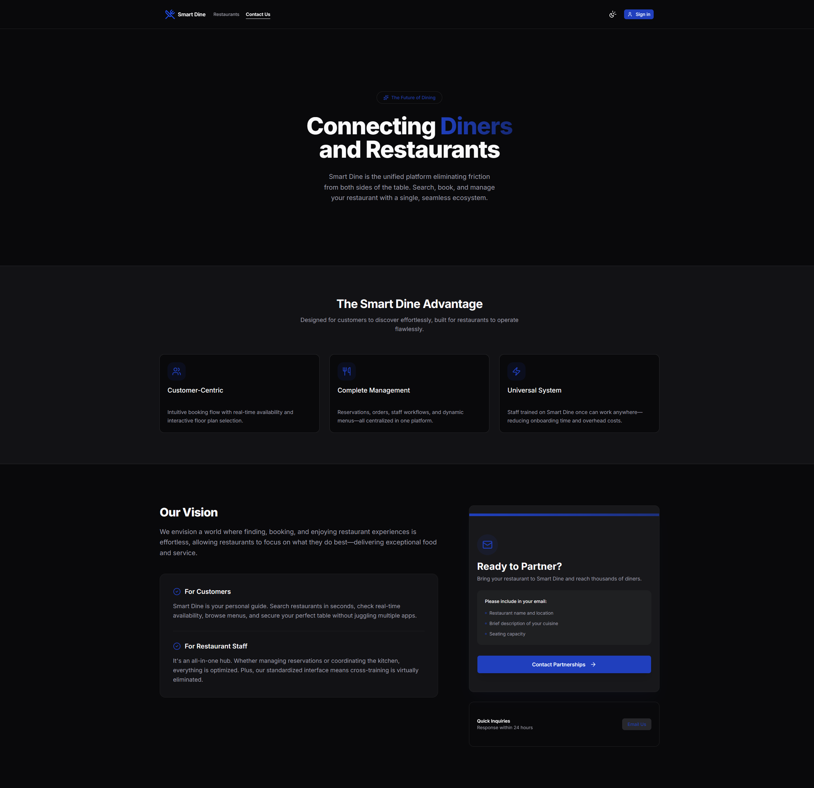
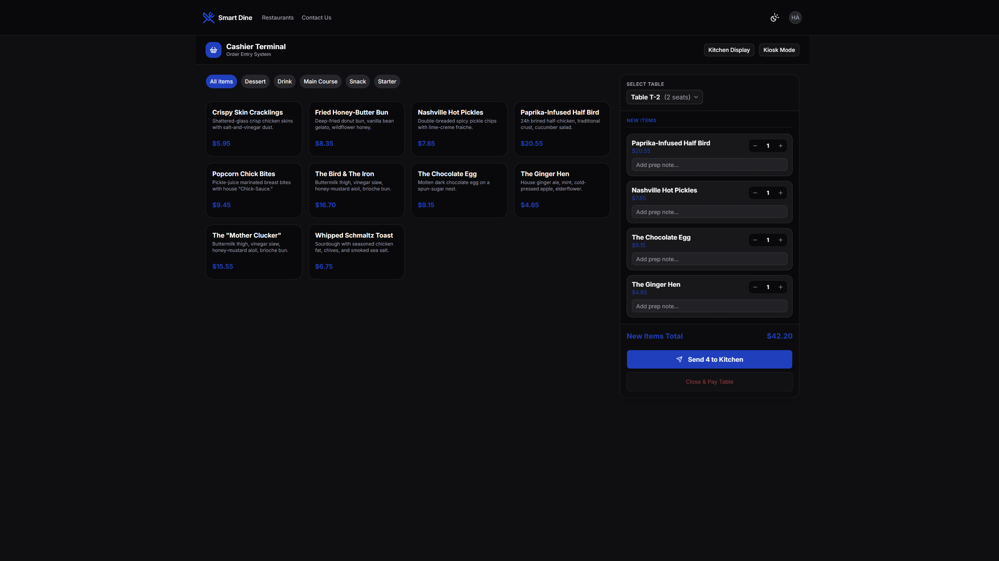
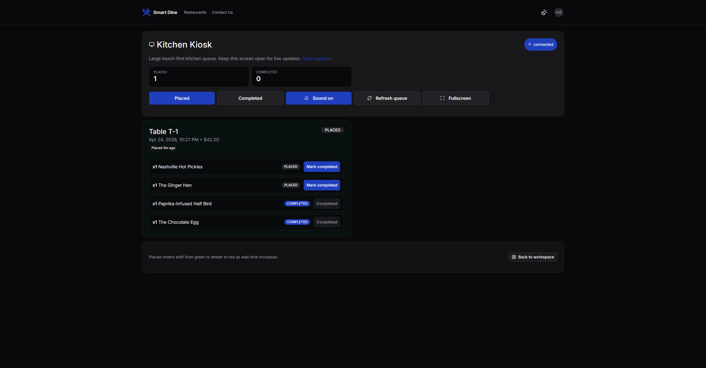
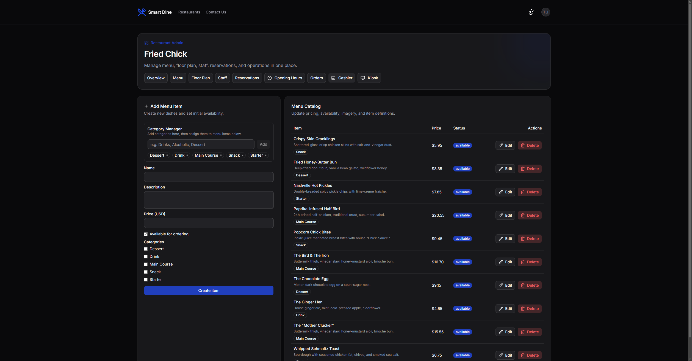
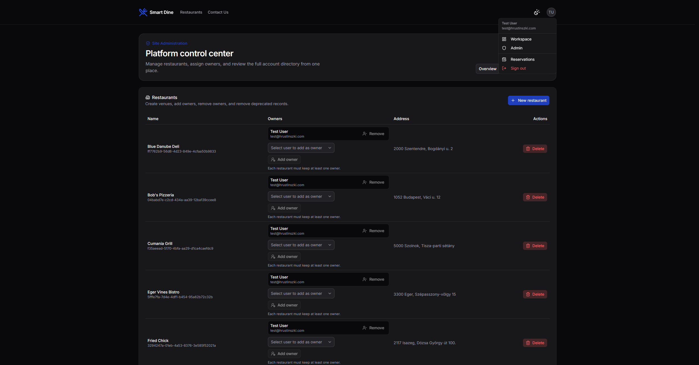

# Smart Dine User Guide

This guide explains what users can do in Smart Dine and how to use the main features.

## Who This Guide Is For

- Diners looking for restaurants and table reservations
- Restaurant staff using cashier or kiosk tools
- Restaurant owners managing operations
- Platform admins managing the system

## Quick Start for Diners

Follow these steps to make your first reservation quickly.

1. Open the home page and search for a restaurant.
2. Open the restaurant details page.
3. Sign in or create an account.
4. Choose date/time and party size.
5. Select an available table and confirm the booking.
6. Open My Reservations to review or cancel upcoming bookings.

Screenshot map (with current screenshots):

1. Home landing and restaurant discovery - route: /
2. Restaurant details - route: /restaurants/:restaurantId
3. Reservation flow and table selection - route: /restaurants/:restaurantId/reservation
4. My Reservations (upcoming/history) - route: /me/reservations

Visual walkthrough:

1. Home and discovery

1. Restaurant details

1. Reserve a table

1. My reservations

Additional user-facing page:

1. Contact page

Quick tips:

- If no table appears, try another time slot or a smaller party size.
- Keep the reservation reference shown after confirmation.
- Use My Reservations for status and cancellations.

## What Users Can Do

### Guest (Not Signed In)

- Browse restaurants from the home page
- Search restaurants by text query
- Open restaurant detail pages
- Read contact information

### Signed-In Diner

- Create an account with email/password
- Sign in with email/password, Google, or GitHub
- Reserve tables using live availability
- Select a table from the interactive floor plan
- View upcoming and past reservations
- Cancel upcoming reservations

### Restaurant Staff (Employee or Owner)

- Open the workspace page
- Access assigned restaurant operations
- Use cashier view for order workflows
- Use kiosk view for live kitchen/order updates

### Restaurant Owner

- Access restaurant admin tools
- Manage restaurant profile details
- Manage menu and menu images
- Manage floor plan and opening hours
- Manage staff and reservations/orders for the restaurant

### Platform Admin

- Access system admin pages
- Manage restaurants
- Manage users
- Assign restaurant ownership

## Role Access Matrix

| Area                   | Guest | Signed-In Diner | Staff (Employee) | Owner | Platform Admin |
| ---------------------- | ----- | --------------- | ---------------- | ----- | -------------- |
| Browse restaurants     | Yes   | Yes             | Yes              | Yes   | Yes            |
| Create reservation     | No    | Yes             | Yes              | Yes   | Yes            |
| My Reservations        | No    | Yes             | Yes              | Yes   | Yes            |
| Workspace page         | No    | Conditional     | Yes              | Yes   | Yes            |
| Cashier                | No    | No              | Yes              | Yes   | Yes            |
| Kiosk                  | No    | No              | Yes              | Yes   | Yes            |
| Restaurant admin pages | No    | No              | No               | Yes   | Yes            |
| System admin pages     | No    | No              | No               | No    | Yes            |

Conditional means access depends on role and assignment for the specific restaurant scope.

## Main User Flows

## 1) Create Account and Sign In

1. Open Sign Up or Sign In from the header.
1. Choose one of the supported methods.

- Email + password
- Google OAuth
- GitHub OAuth

1. After successful auth, Smart Dine redirects to the requested page.

## 2) Discover Restaurants

1. Use the search field on the home page.
2. Review cards showing address, hours, and restaurant info.
3. Open details for a specific restaurant.

## 3) Book a Reservation

1. Open a restaurant reservation page.
2. Select date/time and party size.
3. Run availability check.
4. Pick a free table from the floor map.
5. Confirm reservation and keep the reservation reference.

## 4) Manage My Reservations

1. Open My Reservations.
2. Review Upcoming and History sections.
3. Cancel an eligible upcoming reservation if needed.

## Reservation Status Reference

- pending: Reservation is submitted and awaiting confirmation.
- confirmed: Reservation is approved and active for the scheduled slot.
- completed: Reservation is finished (past dining flow completed).
- cancelled: Reservation was cancelled by user or staff.

Typical user actions by status:

- pending: wait for update, review details.
- confirmed: attend on time, cancel only if needed.
- completed: view in history.
- cancelled: create a new reservation if needed.

## 5) Use Workspace (Staff and Owners)

1. Open Workspace.
1. Select one of your assigned restaurants.
1. Choose a module.

- Restaurant Admin (owners)
- Cashier
- Kiosk

## Workspace Modules at a Glance

- Restaurant Admin: Manage details, menu, floor map, opening hours, staff, and restaurant-level operations.
- Cashier: Create and manage in-restaurant order workflows.
- Kiosk: Monitor live orders with realtime status updates.

Workspace visuals (role-restricted):

1. Cashier (employee/owner)

1. Kitchen kiosk (employee/owner)

1. Restaurant admin menu management (owner/admin)

1. Site administration (platform admin)

## Realtime and Operations

Kiosk pages receive live order updates through Socket.IO events:

- order.created
- order.status.updated
- order.completed
- order.items.updated

This allows kitchen/operations views to update without manual page refresh.

## Access and Permission Model (User View)

Smart Dine applies both authentication and role-based authorization:

- You must be signed in for reservation management and workspace tools.
- Restaurant operations are limited to assigned staff roles.
- Owner-level and admin-level pages are restricted by permission checks.

If you can sign in but cannot open a page, your account likely lacks the required role for that scope.

## First-Day Checklists

### Diner Checklist

1. Create an account or sign in.
2. Complete one test reservation.
3. Confirm reservation appears in My Reservations.
4. Cancel the reservation to verify self-service management.

### Staff Checklist

1. Confirm restaurant assignment appears in Workspace.
2. Open cashier module and verify data loads.
3. Open kiosk module and verify realtime connection status.

### Owner Checklist

1. Open restaurant admin page.
2. Verify menu, floor plan, and opening hours are visible.
3. Confirm staff management actions are available.

## Common Pages

- Home: /
- Contact: /contact
- Sign In: /sign-in
- Sign Up: /sign-up
- My Reservations: /me/reservations
- Workspace: /workspace
- Restaurant Detail: /restaurants/:restaurantId
- Reservation Create: /restaurants/:restaurantId/reservation
- Restaurant Admin: /restaurants/:restaurantId/admin
- Cashier: /restaurants/:restaurantId/cashier
- Kiosk: /restaurants/:restaurantId/kiosk
- System Admin: /admin

## FAQ

### Can I book without signing in?

No. You can browse as a guest, but reservation creation requires authentication.

### Why do I not see Workspace actions?

Workspace actions appear only when your account is assigned to a restaurant role or has admin permissions.

### Why can I see a restaurant but not open its admin pages?

Viewing restaurant information is broader than managing it. Admin pages require owner/admin level permissions.

### Why did a table disappear after I checked availability?

Another booking may have taken that table. Re-run availability and choose another option.

### Does kiosk update automatically?

Yes. Kiosk screens subscribe to realtime order events and update without manual refresh.

## Troubleshooting

### I cannot reserve a table

- Confirm you are signed in.
- Check that date/time is valid and in the future.
- Try a smaller party size or another time slot.

### I cannot access Workspace

- Confirm you are signed in.
- Your account must be assigned to at least one restaurant, or be a platform admin.

### I cannot open Admin pages

- Admin pages require elevated roles and permissions.
- Ask a system admin or owner to update your role assignment.

## Notes

- Some operations depend on realtime connectivity and API availability.
- Reservation availability reflects current slot and table constraints.
- In production, authentication cookies and origins are controlled by deployment environment settings.
- Access in each module is role-scoped and may differ by restaurant assignment.
